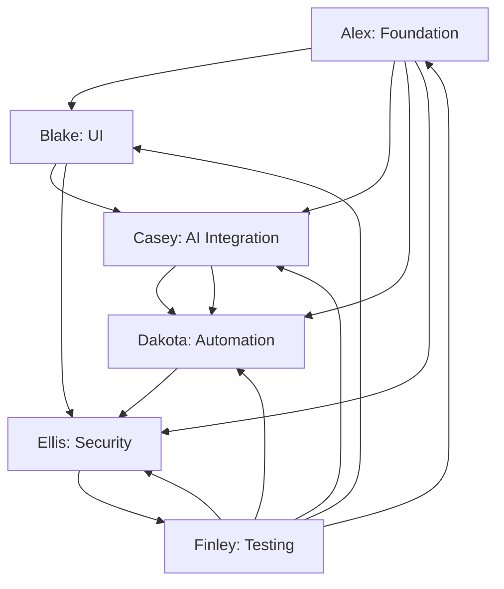

# Agent Coordination Strategy for Ray Chrome Extension Development

## Overview
This document outlines the coordination strategy between 6 agents working simultaneously on the Ray Chrome Extension project using git worktrees. The strategy ensures parallel development while maintaining integration points and avoiding conflicts.

## Agent Roles & Timeline

| Agent | Focus | Timeline | Primary Deliverables |
|---------|--------|-------------------|
| **Alex** | Core Infrastructure | Days 1-3 | manifest.json, build system, Chrome API wrappers |
| **Blake** | UI/Popup Development | Days 2-5 | Popup interface, command input, settings, status display |
| **Casey** | AI Integration | Days 3-6 | OpenRouter API, command parsing, execution orchestration |
| **Dakota** | Browser Automation | Days 4-7 | Content scripts, DOM manipulation, automation engine |
| **Ellis** | Security & Storage | Days 5-8 | API key security, permissions, validation |
| **Finley** | Testing & QA | Days 6-9 | Unit tests, integration tests, E2E tests, security validation |

## Git Worktree Strategy

### Worktree Structure
```bash
# Main branch (integration)
git worktree add main ../ray-browser-extension-main

# Agent worktrees
git worktree add alex ../ray-browser-extension-alex
git worktree add blake ../ray-browser-extension-blake  
git worktree add casey ../ray-browser-extension-casey
git worktree add dakota ../ray-browser-extension-dakota
git worktree add ellis ../ray-browser-extension-ellis
git worktree add finley ../ray-browser-extension-finley
```

### Branch Strategy
- **Main Branch**: `main` - Integration and coordination branch
- **Agent Branches**: `agent/{name}` - Individual agent work
- **Integration Branches**: `integration/{feature}` - Cross-agent feature development
- **Release Branches**: `release/v{version}` - Production releases

## Communication & Integration Points

### 1. Daily Standup Strategy
**Time**: Daily 9:00 AM sync (15 minutes)
**Participants**: All 6 agents
**Agenda**:
1. Yesterday's accomplishments and blockers
2. Today's priorities and coordination needs
3. Cross-agent dependencies and integration points
4. Blocker resolution and conflict resolution

### 2. Integration Liaison System
Each agent has an integration liaison for coordination:

| Agent | Liaison | Responsibility |
|--------|----------|-------------|
| Alex | Ellis | Manifest permissions, security integration |
| Blake | Casey | UI-AI integration, command feedback |
| Casey | Dakota | AI-automation command passing |
| Dakota | Ellis | Automation permissions, security validation |
| Ellis | Finley | Security testing, validation requirements |
| Finley | All | Test coordination, quality gates |

### 3. Shared Interfaces & Contracts

#### API Contracts
**Version**: 1.0.0  
**Format**: TypeScript interfaces in `lib/shared/contracts/`

**Key Contracts**:
```typescript
// Command processing contract (Casey ↔ Dakota)
interface AutomationCommand {
  id: string;
  type: 'navigate' | 'click' | 'fill' | 'scroll' | 'submit';
  selector?: string;
  value?: string;
  url?: string;
  tabId?: number;
}

// UI feedback contract (Blake ↔ Casey)
interface UIStatus {
  status: 'idle' | 'processing' | 'success' | 'error';
  message: string;
  progress?: number;
  currentStep?: string;
}

// Security contract (Ellis ↔ All)
interface SecurityValidation {
  isValid: boolean;
  errors: string[];
  permissions: string[];
  warnings: string[];
}
```

#### Message Passing Protocol
**Standard Format**: JSON messages with type, payload, and timestamp
```typescript
interface AgentMessage {
  from: string;
  to: string;
  type: 'command' | 'status' | 'error' | 'security' | 'test';
  payload: any;
  timestamp: number;
  id: string;
}
```

## Dependency Management

### Critical Path Dependencies


### Integration Timeline
| Day | Alex | Blake | Casey | Dakota | Ellis | Finley | Integration Points |
|-----|-------|-------|--------|---------|-------|-----------------|
| 1 | ✅ | ❌ | ❌ | ❌ | ❌ | Foundation setup |
| 2 | ✅ | 🔄 | ❌ | ❌ | ❌ | UI framework integration |
| 3 | ✅ | ✅ | 🔄 | ❌ | ❌ | AI integration start |
| 4 | ✅ | ✅ | ✅ | 🔄 | ❌ | Automation integration |
| 5 | ✅ | ✅ | ✅ | ✅ | 🔄 | Security integration |
| 6 | ✅ | ✅ | ✅ | ✅ | ✅ | Testing & QA |
| 7 | ✅ | ✅ | ✅ | ✅ | ✅ | ✅ | Integration & Release |

## Conflict Resolution Strategy

### 1. File Conflict Prevention
**Ownership Rules**:
- Each agent owns specific directories (defined in individual task files)
- Shared files in `lib/shared/` require coordination
- No agent modifies another agent's core files without coordination

### 2. Integration Branch Management
**Feature Development**:
- Create `integration/feature-{name}` branches for cross-agent work
- Assign primary agent + required collaborators
- Merge back to main when feature complete

**Conflict Resolution**:
- Daily standup identifies conflicts early
- Integration liaisons resolve conflicts between their paired agents
- Escalate to all-agents meeting if needed

### 3. API Contract Evolution
**Version Management**:
- Semantic versioning for contracts (1.0.0, 1.1.0, etc.)
- Backward compatibility maintained for minor versions
- Breaking changes require agent coordination meeting

**Contract Updates**:
- Proposed by any agent
- Reviewed by integration liaisons
- Approved by majority vote
- Documented in `CHANGELOG.md`

## Testing & Quality Gates

### 1. Continuous Integration
**CI/CD Pipeline**:
- Automated tests on all agent worktrees
- Integration tests for cross-agent functionality
- Security scanning on all changes
- Performance benchmarking

**Quality Gates**:
- All unit tests must pass (Finley's responsibility)
- Integration tests must pass (Finley's responsibility)
- Security scan must pass (Ellis + Finley)
- Code review required from integration liaison

### 2. Release Process
**Pre-release Checklist**:
- [ ] All agent features complete and tested
- [ ] Integration tests passing
- [ ] Security validation complete
- [ ] Performance benchmarks met
- [ ] Documentation updated
- [ ] User acceptance testing complete

**Release Strategy**:
1. Feature freeze on Day 8
2. Final integration testing on Day 9
3. Release candidate creation
4. User acceptance testing
5. Production release

## Communication Tools

### 1. Shared Communication Channels
**Daily Standup**: Video call + shared notes document  
**Integration Liaison**: Slack/Teams channel for each pair  
**All Agents**: Shared channel for announcements and decisions  
**Emergency**: All-agent channel for critical issues

### 2. Documentation Strategy
**Shared Documentation**:
- `README.md` - Project overview and setup
- `CONTRIBUTING.md` - Development guidelines
- `CHANGELOG.md` - Version history and changes
- `INTEGRATION.md` - This coordination document
- `docs/` - Detailed technical documentation

**Agent Documentation**:
- Each agent maintains documentation in their worktree
- Integration points documented in shared docs
- API contracts versioned and shared

### 3. Progress Tracking
**Shared Dashboard**:
- Agent progress status (updated daily)
- Integration test results
- Blocker and issue tracking
- Performance metrics and benchmarks
- Security scan results

## Risk Mitigation

### 1. Technical Risks
**Dependency Risks**:
- Agent delays affecting dependent agents
- Integration contract mismatches
- API contract breaking changes

**Mitigation**:
- Daily standups for early detection
- Integration liaison system for rapid resolution
- Feature flags for gradual rollout

### 2. Communication Risks
**Coordination Challenges**:
- Misaligned priorities between agents
- Unclear integration requirements
- Decision making bottlenecks

**Mitigation**:
- Clear decision-making process
- Documented escalation paths
- Regular integration planning meetings

## Success Metrics

### 1. Development Metrics
- On-time delivery rate per agent
- Integration test pass rate
- Defect escape rate
- Code review coverage

### 2. Quality Metrics
- Unit test coverage > 80%
- Integration test coverage > 90%
- Security scan pass rate = 100%
- Performance benchmark achievement rate

### 3. Team Metrics
- Cross-agent collaboration satisfaction
- Integration issue resolution time
- Knowledge sharing effectiveness
- Overall project velocity

## Emergency Procedures

### 1. Critical Issue Escalation
**Severity Levels**:
- **P1**: Extension broken in production (all agents)
- **P2**: Major feature blocked (primary + integration agents)
- **P3**: Minor issue or question (relevant agents only)

**Response Times**:
- P1: 30 minutes (all agents mobilized)
- P2: 2 hours (integration agents)
- P3: 24 hours (relevant agents)

### 2. Rollback Strategy
**Triggers**:
- Critical security vulnerability discovered
- Major integration failure
- Performance regression in production

**Process**:
1. Immediate feature freeze
2. All-agent emergency meeting
3. Rollback plan execution
4. Post-mortem and prevention planning

This coordination strategy ensures that 6 agents can work effectively in parallel while maintaining the integration and quality standards required for the Ray Chrome Extension project.
## Overview
This document outlines the coordination strategy between 6 agents working simultaneously on the Ray Chrome Extension project using git worktrees. The strategy ensures parallel development while maintaining integration points and avoiding conflicts.

## Agent Roles & Timeline

| Agent | Focus | Timeline | Primary Deliverables |
|---------|--------|-------------------|
| **Alex** | Core Infrastructure | Days 1-3 | manifest.json, build system, Chrome API wrappers |
| **Blake** | UI/Popup Development | Days 2-5 | Popup interface, command input, settings, status display |
| **Casey** | AI Integration | Days 3-6 | OpenRouter API, command parsing, execution orchestration |
| **Dakota** | Browser Automation | Days 4-7 | Content scripts, DOM manipulation, automation engine |
| **Ellis** | Security & Storage | Days 5-8 | API key security, permissions, validation |
| **Finley** | Testing & QA | Days 6-9 | Unit tests, integration tests, E2E tests, security validation |

## Git Worktree Strategy

### Worktree Structure
```bash
# Main branch (integration)
git worktree add main ../ray-browser-extension-main

# Agent worktrees
git worktree add alex ../ray-browser-extension-alex
git worktree add blake ../ray-browser-extension-blake  
git worktree add casey ../ray-browser-extension-casey
git worktree add dakota ../ray-browser-extension-dakota
git worktree add ellis ../ray-browser-extension-ellis
git worktree add finley ../ray-browser-extension-finley
```

### Branch Strategy
- **Main Branch**: `main` - Integration and coordination branch
- **Agent Branches**: `agent/{name}` - Individual agent work
- **Integration Branches**: `integration/{feature}` - Cross-agent feature development
- **Release Branches**: `release/v{version}` - Production releases

## Communication & Integration Points

### 1. Daily Standup Strategy
**Time**: Daily 9:00 AM sync (15 minutes)
**Participants**: All 6 agents
**Agenda**:
1. Yesterday's accomplishments and blockers
2. Today's priorities and coordination needs
3. Cross-agent dependencies and integration points
4. Blocker resolution and conflict resolution

### 2. Integration Liaison System
Each agent has an integration liaison for coordination:

| Agent | Liaison | Responsibility |
|--------|----------|-------------|
| Alex | Ellis | Manifest permissions, security integration |
| Blake | Casey | UI-AI integration, command feedback |
| Casey | Dakota | AI-automation command passing |
| Dakota | Ellis | Automation permissions, security validation |
| Ellis | Finley | Security testing, validation requirements |
| Finley | All | Test coordination, quality gates |

### 3. Shared Interfaces & Contracts

#### API Contracts
**Version**: 1.0.0  
**Format**: TypeScript interfaces in `lib/shared/contracts/`

**Key Contracts**:
```typescript
// Command processing contract (Casey ↔ Dakota)
interface AutomationCommand {
  id: string;
  type: 'navigate' | 'click' | 'fill' | 'scroll' | 'submit';
  selector?: string;
  value?: string;
  url?: string;
  tabId?: number;
}

// UI feedback contract (Blake ↔ Casey)
interface UIStatus {
  status: 'idle' | 'processing' | 'success' | 'error';
  message: string;
  progress?: number;
  currentStep?: string;
}

// Security contract (Ellis ↔ All)
interface SecurityValidation {
  isValid: boolean;
  errors: string[];
  permissions: string[];
  warnings: string[];
}
```

#### Message Passing Protocol
**Standard Format**: JSON messages with type, payload, and timestamp
```typescript
interface AgentMessage {
  from: string;
  to: string;
  type: 'command' | 'status' | 'error' | 'security' | 'test';
  payload: any;
  timestamp: number;
  id: string;
}
```

## Dependency Management

### Critical Path Dependencies


### Integration Timeline
| Day | Alex | Blake | Casey | Dakota | Ellis | Finley | Integration Points |
|-----|-------|-------|--------|---------|-------|-----------------|
| 1 | ✅ | ❌ | ❌ | ❌ | ❌ | Foundation setup |
| 2 | ✅ | 🔄 | ❌ | ❌ | ❌ | UI framework integration |
| 3 | ✅ | ✅ | 🔄 | ❌ | ❌ | AI integration start |
| 4 | ✅ | ✅ | ✅ | 🔄 | ❌ | Automation integration |
| 5 | ✅ | ✅ | ✅ | ✅ | 🔄 | Security integration |
| 6 | ✅ | ✅ | ✅ | ✅ | ✅ | Testing & QA |
| 7 | ✅ | ✅ | ✅ | ✅ | ✅ | ✅ | Integration & Release |

## Conflict Resolution Strategy

### 1. File Conflict Prevention
**Ownership Rules**:
- Each agent owns specific directories (defined in individual task files)
- Shared files in `lib/shared/` require coordination
- No agent modifies another agent's core files without coordination

### 2. Integration Branch Management
**Feature Development**:
- Create `integration/feature-{name}` branches for cross-agent work
- Assign primary agent + required collaborators
- Merge back to main when feature complete

**Conflict Resolution**:
- Daily standup identifies conflicts early
- Integration liaisons resolve conflicts between their paired agents
- Escalate to all-agents meeting if needed

### 3. API Contract Evolution
**Version Management**:
- Semantic versioning for contracts (1.0.0, 1.1.0, etc.)
- Backward compatibility maintained for minor versions
- Breaking changes require agent coordination meeting

**Contract Updates**:
- Proposed by any agent
- Reviewed by integration liaisons
- Approved by majority vote
- Documented in `CHANGELOG.md`

## Testing & Quality Gates

### 1. Continuous Integration
**CI/CD Pipeline**:
- Automated tests on all agent worktrees
- Integration tests for cross-agent functionality
- Security scanning on all changes
- Performance benchmarking

**Quality Gates**:
- All unit tests must pass (Finley's responsibility)
- Integration tests must pass (Finley's responsibility)
- Security scan must pass (Ellis + Finley)
- Code review required from integration liaison

### 2. Release Process
**Pre-release Checklist**:
- [ ] All agent features complete and tested
- [ ] Integration tests passing
- [ ] Security validation complete
- [ ] Performance benchmarks met
- [ ] Documentation updated
- [ ] User acceptance testing complete

**Release Strategy**:
1. Feature freeze on Day 8
2. Final integration testing on Day 9
3. Release candidate creation
4. User acceptance testing
5. Production release

## Communication Tools

### 1. Shared Communication Channels
**Daily Standup**: Video call + shared notes document  
**Integration Liaison**: Slack/Teams channel for each pair  
**All Agents**: Shared channel for announcements and decisions  
**Emergency**: All-agent channel for critical issues

### 2. Documentation Strategy
**Shared Documentation**:
- `README.md` - Project overview and setup
- `CONTRIBUTING.md` - Development guidelines
- `CHANGELOG.md` - Version history and changes
- `INTEGRATION.md` - This coordination document
- `docs/` - Detailed technical documentation

**Agent Documentation**:
- Each agent maintains documentation in their worktree
- Integration points documented in shared docs
- API contracts versioned and shared

### 3. Progress Tracking
**Shared Dashboard**:
- Agent progress status (updated daily)
- Integration test results
- Blocker and issue tracking
- Performance metrics and benchmarks
- Security scan results

## Risk Mitigation

### 1. Technical Risks
**Dependency Risks**:
- Agent delays affecting dependent agents
- Integration contract mismatches
- API contract breaking changes

**Mitigation**:
- Daily standups for early detection
- Integration liaison system for rapid resolution
- Feature flags for gradual rollout

### 2. Communication Risks
**Coordination Challenges**:
- Misaligned priorities between agents
- Unclear integration requirements
- Decision making bottlenecks

**Mitigation**:
- Clear decision-making process
- Documented escalation paths
- Regular integration planning meetings

## Success Metrics

### 1. Development Metrics
- On-time delivery rate per agent
- Integration test pass rate
- Defect escape rate
- Code review coverage

### 2. Quality Metrics
- Unit test coverage > 80%
- Integration test coverage > 90%
- Security scan pass rate = 100%
- Performance benchmark achievement rate

### 3. Team Metrics
- Cross-agent collaboration satisfaction
- Integration issue resolution time
- Knowledge sharing effectiveness
- Overall project velocity

## Emergency Procedures

### 1. Critical Issue Escalation
**Severity Levels**:
- **P1**: Extension broken in production (all agents)
- **P2**: Major feature blocked (primary + integration agents)
- **P3**: Minor issue or question (relevant agents only)

**Response Times**:
- P1: 30 minutes (all agents mobilized)
- P2: 2 hours (integration agents)
- P3: 24 hours (relevant agents)

### 2. Rollback Strategy
**Triggers**:
- Critical security vulnerability discovered
- Major integration failure
- Performance regression in production

**Process**:
1. Immediate feature freeze
2. All-agent emergency meeting
3. Rollback plan execution
4. Post-mortem and prevention planning

This coordination strategy ensures that 6 agents can work effectively in parallel while maintaining the integration and quality standards required for the Ray Chrome Extension project.
